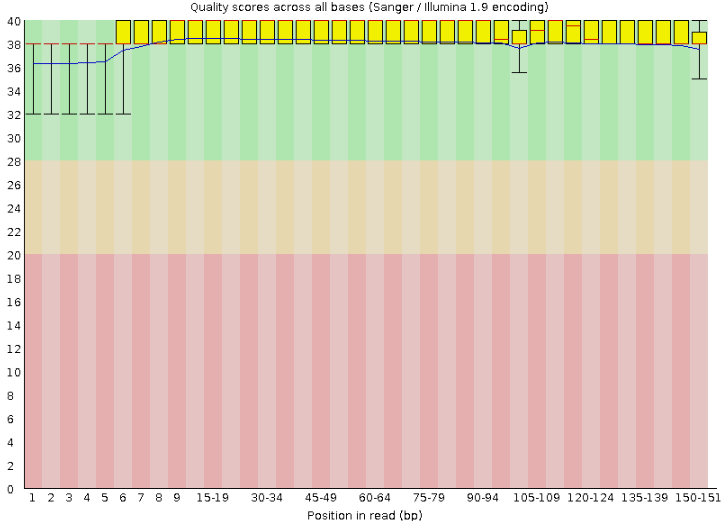

# Class 2.1: Quality control and filtering of metagenomics sequences

- - - -

The two samples used throughout this workshop come from a previous study performed by [Meziti et al. 2021](https://journals.asm.org/doi/10.1128/aem.02593-20). The data is a result of the project EcoZUR (_E. coli_ in Urban and Rural Areas), a case-control study of diarreha carried out in northern Ecuadro during April 2014 - April 2015 ([Peña-González et al. 2019](https://journals.asm.org/doi/full/10.1128/aem.01820-19)). All datasets generated from this project were deposited under the BioProject ID [PRJNA486009](https://www.ncbi.nlm.nih.gov/bioproject/?term=PRJNA486009).

The two samples correspond to the following:

Accession|Condition|File size
:--------|:--------|---------
SRR9988196|Diarrhea|2.6 Gb (each)
SRR8555091|Control|2.6 Gb (each)

> All data and intermediate files of the pipeline are stored in `/home/public/met-workshop`. We encourage the participants to type their own code and use their own output files. However, some analysis require time to be completed, and the ~30 jobs running at the same time might saturate the cluster. Therefore, in some cases, it would be needed to call or copy file from this path. Take a look at the directory, analyze the organization, and where all data is located.

## Downloading the data (fasterq-dump)

The first step is downloading the data from the NCBI. For this, the tool `fasterq-dump` will be used.

> In a real-life case, sequencing data is uploaded to the computational cluster using the command `scp`. If you have any doubt regarding its usage, ask your instructor.

`fasterq-dump` is a optimized version of an older tool called `fastq-dump` (mentioned in the previous class). This allows to extract data in `.fastq` or `.fasta` format from SRA accessions of the NCBI. Althought this tool is a successor, the options are different from the prior software. Hence, it is not a replacement and both tools can still be used. Particularly `fasterq-dump` is faster and easier to use than `fastq-dump`.

This tool is part of the [sra-toolkit](https://github.com/ncbi/sra-tools). Therefore, in order to be used the toolkit must be installed. This software is downloaded as a singularity container in the path `/opt/ohpc/pub/containers/BIO/`. Take a look at the directory and explore the installed softwares.

```bash
[dorian.rojas@accessnode test]$ ls /opt/ohpc/pub/containers/BIO/
abyss-2.3.10.sif                freesurfer-7.4.1.sif     picrust2-2.5.3.sif
admixture-1.3.0.sif             funannotate-1.8.17.sif   pilon-1.24.sif
antismash-7.1.0.sif             gatk4-4.5.0.0.sif        platon-1.7.sif
anvio-7.sif                     gatk4-4.6.0.0.sif        plink-1.9.sif
bactopia-3.1.0.sif              genflow.sif              plink-2.0.sif
bakta-1.9.4.sif                 gtdbtk-2.4.0.sif         prodigal-2.6.3.sif
bandage-0.8.1.sif               gunc-1.0.6.sif           prokka-1.14.6.sif
barrnap-0.9.sif                 hisat2-2.2.1.sif         qiime2-amplicon-2024.5.sif
bbmap-39.10.sif                 hmmer-3.4.sif            qiime2-metagenome-2024.5.sif
bcftools-1.21.sif               htslib-1.21.sif          qualimap-2.3.sif
bedtools-2.3.1.sif              hybracter-0.9.1.sif      quast-5.2.0.sif
biostars.sif                    idops-0.2.2.sif          rfmix-2.03.sif
blast-2.16.0.sif                impute2-2.3.2.sif        rgi-6.0.3.sif
blobtoolkit-4.3.9.sif           instrain-1.9.0.sif       saige-1.3.0.sif
bowtie-1.3.1.sif                kofamscan-1.3.0.sif      sambamba-1.0.1.sif
bowtie2-2.5.4.sif               longqc-1.2.0c.sif        samtools-1.21.sif
busco-5.8.0.sif                 masurca-4.1.1.sif        seqtk-1.4.sif
bwa-0.7.18.sif                  mdmcleaner-0.8.2.sif     shapeit-2.r837.sif
canu-2.2.sif                    medaka-2.0.1.sif         smartdenovo-1.0.0.sif
checkm2-1.0.2.sif               medusa-1.6.sif           sourmash-4.8.11.sif
checkm-genome-1.2.3.sif         megahit-1.2.9.sif        spades-4.0.0.sif
clustalo-1.2.4.sif              metabat2-2.17.sif        sra-toolkit-2.9.3.sif
cogclassifier-1.0.3.sif         metawrap-1.2.sif         sra-toolkit-3.1.0.sif
cutadapt-4.9.sif                multiqc-1.25.1.sif       sra-tools-3.1.1.sif
diamond-2.1.9.sif               nanofilt-2.8.0.sif       star-2.7.11b.sif
diamond_add_taxonomy-0.1.2.sif  nanopack.sif             structure-2.3.4.sif
ecami.sif                       nanoplot-1.43.0.sif      trimmomatic-0.38.sif
ensembl-vep-112.0.sif           necat-0.0.1.sif          unicycler-0.5.1.sif
fastp-0.23.3.sif                neptune-1.2.5.sif        vep-86.sif
fastqc-0.12.1.sif               nextpolish-1.4.1.sif     vsearch-2.29.0.sif
filtlong-0.2.1.sif              orthofinder-3.0.1b1.sif  wengan-0.2.sif
flye-2.9.5.sif                  pgap-7555.sif
```

Note that there are several versions of the sra-toolkit. Commonly, the latest version (`sra-toolkit-3.1.1.sif`) is used.

The first step at starting any pipeline is understanding how the tool works and what are the required arguments. This can be achieved by command line using the `--help` flag or searching the documentation in the internet. In most cases, the information of tools usage is located in github repositiories. For instance, this is the github of [`fasterq-dump`](https://github.com/ncbi/sra-tools/wiki/HowTo:-fasterq-dump).

Additionally, when working with new softwares, it is relevant to read and understand what's behind the program. During this workshop, a summary of the tools' workflows is in this repository, meanwhile the usage will be explore by command line.

### Running fasterq-dump

Briefly, `fasterq-dump` is a tool that connects directly to the SRA accession provided as argument in the command line. Accessions are not files, but containers of files. Therefore, depending on the id more than one fill can be downloaded. In our case, the samples correspond to Illumina paired-end data; thus, `fasterq-dump` will created two files in the working directory.

Explore the software flags and usage.

```bash
[dorian.rojas@accessnode test]$ /opt/ohpc/pub/containers/BIO/sra-tools-3.1.1.sif fasterq-dump -h

Usage:
  fasterq-dump <path> [options]
  fasterq-dump <accession> [options]

Options:
  -F|--format                      format (special, fastq, default=fastq)
  -o|--outfile                     output-file
  -O|--outdir                      output-dir
  -b|--bufsize                     size of file-buffer dflt=1MB
  -c|--curcache                    size of cursor-cache dflt=10MB
  -m|--mem                         memory limit for sorting dflt=100MB
  -t|--temp                        where to put temp. files dflt=curr dir
  -e|--threads                     how many thread dflt=6
  -p|--progress                    show progress
  -x|--details                     print details
  -s|--split-spot                  split spots into reads
  -S|--split-files                 write reads into different files
  -3|--split-3                     writes single reads in special file
  --concatenate-reads              writes whole spots into one file
  -Z|--stdout                      print output to stdout
  -f|--force                       force to overwrite existing file(s)
  --skip-technical                 skip technical reads
  --include-technical              include technical reads
  -M|--min-read-len                filter by sequence-len
  --table                          which seq-table to use in case of pacbio
  -B|--bases                       filter by bases
  -A|--append                      append to output-file
  --fasta                          produce FASTA output
  --fasta-unsorted                 produce FASTA output, unsorted
  --fasta-ref-tbl                  produce FASTA output from REFERENCE tbl
  --fasta-concat-all               concatenate all rows and produce FASTA
  --internal-ref                   extract only internal REFERENCEs
  --external-ref                   extract only external REFERENCEs
  --ref-name                       extract only these REFERENCEs
  --ref-report                     enumerate references
  --use-name                       print name instead of seq-id
  --seq-defline                    custom defline for sequence:  $ac=accession,
                                   $sn=spot-name,  $sg=spot-group, $si=spot-id,
                                   $ri=read-id, $rl=read-length
  --qual-defline                   custom defline for qualities:  same as
                                   seq-defline
  -U|--only-unaligned              process only unaligned reads
  -a|--only-aligned                process only aligned reads
  --disk-limit                     explicitly set disk-limit
  --disk-limit-tmp                 explicitly set disk-limit for temp. files
  --size-check                     switch to control: on=perform size-check
                                   (default),  off=do not perform size-check,
                                   only=perform size-check only
  --ngc <PATH>                     PATH to ngc file

  -h|--help                        Output brief explanation for the program.
  -V|--version                     Display the version of the program then
                                   quit.
  -L|--log-level <level>           Logging level as number or enum string. One
                                   of (fatal|sys|int|err|warn|info|debug) or
                                   (0-6) Current/default is warn.
  -v|--verbose                     Increase the verbosity of the program
                                   status messages. Use multiple times for more
                                   verbosity. Negates quiet.
  -q|--quiet                       Turn off all status messages for the
                                   program. Negated by verbose.
  --option-file <file>             Read more options and parameters from the
                                   file.
for more information visit:
   https://github.com/ncbi/sra-tools/wiki/HowTo:-fasterq-dump
   https://github.com/ncbi/sra-tools/wiki/08.-prefetch-and-fasterq-dump

fasterq-dump : 3.1.1
```

This holds a great variety of options to download data. However, the only required argument is the SRA accession. The aim is to perform a simple download of the accessions in a directory called `1-data`. In this directory, all the raw data will be stored. Read the usage information displayed in the terminal and try to create the files required to download the data.

**Recomendations:**

1. Remember three file are required to make the pipeline work: `accessions.txt`, `batch.sh`, and `.slurm`. Go back to the previous class to refresh the template provided for the slurm header and batch file.
2. The accession file consists of only the accessions in separate lines. Create the file using `nano` and copy paste the accessions from the beginning of this class.
3. Some tools create output directories if they do not exist (`fasterq-dump` does). However, it is recommended to create them in advance to avoid errors.
4. Personally, `.slurm` files are named after the tools. For instance, this specific slurm would be called `fasterq-dump.slurm`. This is a personal preference, and these files can be any name.
5. All code files are deposited in the path `/home/public/met-workshop` and at the end of this github page. If the case of doubts regarding errors, ask the instructor or revise the documents.

> Again, we encourage the participants to avoide copying and pasting the template in your files. The idea of the workshop is to get familiar with typing and understanding the commands. This might sound archaic, but try and code from scratch!

To run the `.slurm` files with `batch.sh`, the command `sh` is required.

```bash
[dorian.rojas@accessnode test]$ sh batch.sh
Submitted batch job 1934
Submitted batch job 1935
```

The job number will change. Check the jobs are running using the `squeue` command.

```bash
[dorian.rojas@accessnode test]$ squeue
             JOBID PARTITION     NAME     USER ST       TIME  NODES NODELIST(REASON)
              1926  parallel     bash tatiana.  R    1:22:06      1 cn001
              1931  parallel      job luis.arr  R      17:32      6 cn[002-007]
              1934  parallel  fasterq dorian.r  R       0:02      1 cn008
              1935  parallel  fasterq dorian.r  R       0:02      1 cn009
```

Slurm will automatically generate two files in the current directory corresponding to `.o` and `.e` output documents. These files are important to check in case of failure.

Jobs might take a while (around 15 to 20 minutes) to finish. Take a break or explore other flags of the software. Remember to pay attention to the email to check whereas your job has ended or failed.

This is probably the simplest command used in this workshop, but don't be scared! The first one is also the hardest :)

Once the job has ended, check the `1-data` directory. Four files corresponding to the paired end reads of each accession must be present. Check the tool worked correctly by reading the last lines of the `.o` file. These documents (`.o`, `.e`) can be deleted. However, it is recommeded to store them into a new directory. They might come handy at some point throught the pipeline.

```bash
[dorian.rojas@accessnode test]$ ll 1-data/
total 10968184
-rw-rw-r-- 1 dorian.rojas dorian.rojas 2917900668 dic 17 13:48 SRR8555091_1.fastq
-rw-rw-r-- 1 dorian.rojas dorian.rojas 2917455268 dic 17 13:48 SRR8555091_2.fastq
-rw-rw-r-- 1 dorian.rojas dorian.rojas 2698077902 dic  6 12:02 SRR9988196_1.fastq
-rw-rw-r-- 1 dorian.rojas dorian.rojas 2697976540 dic  6 12:02 SRR9988196_2.fastq
[dorian.rojas@accessnode test]$ mkdir 00-logs
[dorian.rojas@accessnode test]$ mv zz-read_qc-193* 00-logs/
[dorian.rojas@accessnode test]$ ls 00-logs/
zz-read_qc-1934.e  zz-read_qc-1934.o  zz-read_qc-1935.e  zz-read_qc-1935.o
```

This completes the first part of the class. Next, reads are require to undergo quality control and filtering.

## Quality control and filtering of metagenomics data (metaWRAP read_qc module)

Sequencing reads are commonly found as `.fastq` files. This extension indictaes the presence of information regarding the basecalling quality score. The Phred quality is depicted in ASCII format developed for Sanger sequencing technologies. The quality (Q) is the probability (P) of an incorrect basecalling. It can be mathematically represented.

$Q = -10 log_{10}(P)$

The ASCII displays a great variety of characters representing numbers from one to 42 (for Phred base 33, which is the most common code currently). The quality score is interpreted as a logaritmic expression. Therefore, a Q10 would be 1 error per each 10bp, Q20 means 1 error each 100bp, and so forth. Image from [USEARCH](https://www.drive5.com/usearch/manual/quality_score.html)


Quality scores can vary widely depending on the sequencing technique. Long reads (e.g. PacBio, Nanopore) tend to present lower qualities than short reads (e.g. Illumina). In addition, it is common to see decresing qualities in the latest bases due to polymerase exhaustation. It is agreed that high quality bases have a Q score of >30, medium quality is between Q30 and Q20, and low quality scores are below Q20.

Qualities can be presented in different ways. The most common graphs are boxplots similar to those found in `FastQC` results (a tool later explored). For instance, in the image below, all bases present a very high quality with a mean average >35. Those bases with lesser quality at the beganing of reads might be related to the presence of adapters, which are frequently removed during trimming and filtering.



Trimming and filtering are often used as synonyms in sequencing data processing. They both refer to the removal of low quality reads, adapters, short sequences, primers, and/or fixing paired-end issues (e.g. data is not correctly paired, one sequence is unpaired). Overall, this allows to enhance the general quality of the sequencing data.

### MetaWRAP read_qc module

Great part of the pipeline is performed throught the tool [metaWRAP](https://github.com/bxlab/metaWRAP). This is a wrapper made as a easy-to-use suite for metagenomics analysis. This means it alone does not perform any analysis, but it comprises several tools used to perform the jobs of interest. Hence, metaWRAP basically writes a command that runs all the other tools within its environment.

There are a vast variety of schemes to perform metagenomics analysis. For instance, one could use individual tools and different flags and parameters. However, metaWRAP serves as a parameterizer allowing a greater reproducibility. Moreover, the wrapper uses general databases and tools, which favors the analysis of different types of microbiomes (e.g. gut, water, soil) as demonstrated in the [benchmark paper](https://microbiomejournal.biomedcentral.com/articles/10.1186/s40168-018-0541-1).

> During the workshop, various modules will be used. Each module is stand-alone; therefore, required modules can be used separately.

First, explore the read_qc module to conduct the quality control and filtering of the metagenomics data.

This module consist of a set of tools that enable the pre-process, trimming, and filtering of metagenomic data. For this, the workflow employs FastQC, TrimGalore, and BMTagger.

[FatsQC](https://github.com/s-andrews/FastQC) is a program that spots potential problems in sequencing datasets. It can analyze multiple files in `.fastq`, `.sam`, or `.bam` format and provides a quick overview the quality metrics. This software works on any kind of data (e.g. small reads, long reads, RNA sequecing); however, it is optimized for sequencing data from Illumina Technologies. Interestingly, this tool was developed as both an offline java application and a software for computational clusters. The main result of FastQC are `.html` files that summarize the quality metrics. It is important to remark that this tool only checks the quality of the reads, and does not performs any modification. [Here](https://www.bioinformatics.babraham.ac.uk/projects/fastqc/) is the webpage in which FastQC was published.

[TrimGalore](https://github.com/FelixKrueger/TrimGalore) is a wrapper tool that involves [Cutadapt](https://github.com/marcelm/cutadapt) and FastQC to perform the trimming. This removes low quality bases/reads, adapters, primers, short reads, among other undesirable features that could be present through Cutadapt. For this, an initial trimming of low quality bases in the 3' end is conducted prior the adapter removal. Adapters are autodetected based on one million sequences of the first file, looking for the 12bp or 13bp standard adapters (from Illumina, Small RNA, and Nextera). If adapter can't be autodetected, `--illumina` is used as default, and if there is a tie between Nextera and Small RNA `--nextera` is default. However, adapter sequences can also be provided in the standalone wrapper. Finally, TrimGalore removes short sequences (default: <20bp) that might result from the trimming. In addition, it performs a quality check of the data using FastQC.  

[BMTagger](https://bioconda.github.io/recipes/bmtagger/README.html) (Best Match Tagger) is a tool that removes the human reads (contamination) from the metagenomic datatsets. This software discriminates based on the provided index file created with bmtools (which might be a [little complex to create](https://www.hmpdacc.org/doc/HumanSequenceRemoval_SOP.pdf)). Therefore, it avoids the time-consuming and computational-demanding aligments other tools require. In the case of metaWRAP, this wappers uses BMTagger with the human genome reference hg38 index already included. For this, this tool compares the query through 18mers to the human genome. However, if the comparison fails, an aligment is performed to remove the sequences with up to two errors.

### Running metawrap read_qc

Due to the installation process, metaWRAP runs differently. It does not use a singularity container, but a miniforge3 environment. This environment must be activated in both the terminal and slurm file you are going to use. In order to activate it this command must be run and written right after the working directory is set in the `.slurm` file.

```bash
. /home/dorian.rojas/bin/miniforge3/bin/activate metawrap-env

[dorian.rojas@accessnode test]$ . /home/dorian.rojas/bin/miniforge3/bin/activate metawrap-env
(metawrap-env) [dorian.rojas@accessnode test]$
```

When running in the terminal, the name of the environment `metawrap-env` appears in front of the username. This indicates the env is activated and metaWRAP can be call normally. In the slurm file, the environment is activated within the job and metaWRAP will work correctly.

The first step prior to coding is understading how the module works. This is explored above. Subsequently, take a look at the usage of metaWRAP.

```bash
(metawrap-env) [dorian.rojas@accessnode test]$ metawrap -h

MetaWRAP v=1.3.2
Usage: metaWRAP [module]

        Modules:
        read_qc         Raw read QC module (read trimming and contamination removal)
        assembly        Assembly module (metagenomic assembly)
        kraken          KRAKEN module (taxonomy annotation of reads and assemblies)
        kraken2         KRAKEN2 module (taxonomy annotation of reads and assemblies)
        blobology       Blobology module (GC vs Abund plots of contigs and bins)

        binning         Binning module (metabat, maxbin, or concoct)
        bin_refinement  Refinement of bins from binning module
        reassemble_bins Reassemble bins using metagenomic reads
        quant_bins      Quantify the abundance of each bin across samples
        classify_bins   Assign taxonomy to genomic bins
        annotate_bins   Functional annotation of draft genomes

        --help | -h             show this help message
        --version | -v  show metaWRAP version
        --show-config   show where the metawrap configuration files are stored
```

This shows all the modules of metawrap. The module of interest is `read_qc`. Hence, the `-h` command must be used specifically for that module.

```bash
(metawrap-env) [dorian.rojas@accessnode test]$ metawrap read_qc -h
metawrap read_qc -h

Usage: metaWRAP read_qc [options] -1 reads_1.fastq -2 reads_2.fastq -o output_dir
Note: the read files have to be named in the name_1.fastq/name_2.fastq convention.
Options:

        -1 STR          forward fastq reads
        -2 STR          reverse fastq reads
        -o STR          output directory
        -t INT          number of threads (default=1)
        -x STR          prefix of host index in bmtagger database folder (default=hg38)

        --skip-bmtagger         dont remove human sequences with bmtagger
        --skip-trimming         dont trim sequences with trimgalore
        --skip-pre-qc-report    dont make FastQC report of input sequences
        --skip-post-qc-report   dont make FastQC report of final sequences


real    0m0,015s
user    0m0,005s
sys     0m0,008s
```

This displays the usage of the module. Type the `read_qc.slurm` file taking in consideration what's here read about the quality control. The template can be found at the end of this page.

> Before running `batch.sh` file, remember to change the name of the `.slurm`. Otherwise, the `fasterq-dump.slurm` job will be sent again :)

```vim
#!/bin/bash

sample1="$(sed -n '1p' accessions.txt)"
sample2="$(sed -n '2p' accessions.txt)"

sbatch read_qc.slurm $sample1
sbatch read_qc.slurm $sample2
```

### Quality control interpretation

The outputs from the read_qc module are four files and two directories with the FastQC reports pre- and post-trimming, in each sample directory created in the command.

```bash
(metawrap-env) [dorian.rojas@accessnode 2-read_qc]$ ls -F *
SRR8555091:
final_pure_reads_1.fastq  host_reads_1.fastq  post-QC_report/
final_pure_reads_2.fastq  host_reads_2.fastq  pre-QC_report/

SRR9988196:
final_pure_reads_1.fastq  host_reads_1.fastq  post-QC_report/
final_pure_reads_2.fastq  host_reads_2.fastq  pre-QC_report/
```

The `final_pure_reads_?.fastq` files are the filtered clean reads, meanwhile `host_reads_?.fastq` are the human sequences removed by BMTagger. The formers are the ones used in the rest of the pipeline.

Although trimmed files are ready to continue their analysis, it is highly important to check the FastQC reports. This is performed in order to check the correct functioning of the filtering process and ensuring the quantity of reads remove does not significantly affects the sequencing depth. Considering that the reports are `.html` files, they must be downloaded into the computer. For this, the `scp` command is essential.

The `scp` command must be run in the desk computer terminal, not inside the computational cluster. Its required arguments are the location, path to the file of interest, and the destionation. For instance, considering a location `dorian.rojas@172.16.24.2`, the path `/home/dorian.rojas/test/2-read_qc/SRR8555091/*/*.html`, and the desktop folder of the computer as the destination, the command in a Windows terminal would be:

```bash
C:\Users\rojas\OneDrive\Desktop> scp dorian.rojas@172.16.24.2:/home/dorian.rojas/test/2-read_qc/SRR8555091/*/*.html .
```

The usage of the asterik wildcard `*` indicates `scp` to copy all the `.html` files found in all the directories of the `home/dorian.rojas/test/2-read_qc/SRR8555091` path. To facilitate the command, the current directory is set to the computer desktop and depicted as a period `.`. In Bash, the `.` is a 'secret' folder that represents the current directory. This is similar as how the directory `..` means the parent folder.

It is throughly important to analyze the files of interest. All outputs from metaWRAP have the same name regardless of the sample (or at least for the `post-QC_report`). Hence, samples must be downloaded separately to avoid overwritting the files. It is recommended to download one sample, create a directory with the sample name, move files into respective directory, and proceed to download the next sample. The end product in the desktop is something similar to this:

```bash
C:\Users\rojas\OneDrive\Desktop\docs_curso\read_qc>tree /f
Folder PATH listing for volume Windows
Volume serial number is 90F6-E25D
C:.
├───SRR8555091
│       final_pure_reads_1_fastqc.html
│       final_pure_reads_2_fastqc.html
│       SRR8555091_1_fastqc.html
│       SRR8555091_2_fastqc.html
│
└───SRR9988196
        final_pure_reads_1_fastqc.html
        final_pure_reads_2_fastqc.html
        SRR9988196_1_fastqc.html
        SRR9988196_2_fastqc.html
```

Open each file and analyze them as html.

## Task solutions

**accession.txt file:**

```bash
[dorian.rojas@accessnode test]$ cat accessions.txt
SRR9988196
SRR8555091
```

**batch.sh file:**

```vim
#!/bin/bash

sample1="$(sed -n '1p' accessions.txt)"
sample2="$(sed -n '2p' accessions.txt)"

sbatch read_qc.slurm $sample1
sbatch read_qc.slurm $sample2
```

**fasterq-dump.slurm:**

```vim
#!/bin/bash
#SBATCH --partition=parallel
#SBATCH --account=parallel-24h
#SBATCH --time=24:00:00
#SBATCH --nodes=1
#SBATCH --ntasks-per-node=64
#SBATCH --job-name="fasterq"
#SBATCH -o zz-%x-%j.o
#SBATCH -e zz-%x-%j.e
#SBATCH --mail-user=dorian.rojas@ucr.ac.cr
#SBATCH --mail-type=END,FAIL

cd /home/dorian.rojas/test

CTN_PATH=/opt/ohpc/pub/containers/BIO/
$CTN_PATH/sra-tools-3.1.1.sif fasterq-dump --version

for id in $@; do

echo "Downloading " $id
$CTN_PATH/sra-tools-3.1.1.sif fasterq-dump -O ./1-data $id
echo $id " downloaded"

done

date
time
```

**read_qc.slurm:**

```vim
#!/bin/bash
#SBATCH --partition=parallel
#SBATCH --account=parallel-24h
#SBATCH --time=24:00:00
#SBATCH --nodes=1
#SBATCH --ntasks-per-node=64
#SBATCH --job-name="read_qc"
#SBATCH -o zz-%x-%j.o
#SBATCH -e zz-%x-%j.e
#SBATCH --mail-user=dorian.rojas@ucr.ac.cr
#SBATCH --mail-type=END,FAIL

cd /home/dorian.rojas/test

. ~/bin/miniforge3/bin/activate metawrap-env

for sample in $@; do

echo "Working on " $sample

mkdir 2-read_qc/$sample

metawrap read_qc -1 1-data/${sample}_1.fastq \
        -2 1-data/${sample}_2.fastq \
        -t 64 -o 2-read_qc/$sample

echo $sample " done"

done

date
time
```
