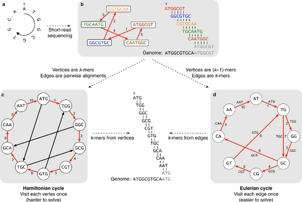

# Class 2.2: Metagenome-assembled genomes assembly, binning, refinement, reassemble

- - - -

## Metagenomic assembly (metaWRAP assembly module)

Sequencing reads are produced randomly and there is no particular order in how DNA or RNA sequences appear in `.fastq` files. Therefore, it is impossible and inaccurate to interpret the raw data as complete or ordered genomes. To reconstruct the genome of organisms the computational process of genome assembly must be undergone. For this, it is common to align the raw reads which is a computationally demanding process.

Genome aseemble have two main algorithms: the Overlap Layout Consensus (OLC) and Debruijn Graph (DBG). The lastest is the most used and implemented in current assembler. In some cases, a circular bacterial genome can be obtained by assembly. However, when unresolvable repeats (without connection) are present, the assembly is broken into fragments called contigs (short for contiguous). Contigs do not contain gaps and are the most common form in which uncomplete assemblies can be found. These contigs can be assembled into scaffolds by ordering and orienting them correctly, creating gaps filled with NNN's.

The OLC methods is purely based on the aligment of each sequenced reads in an attempt to find overlaps. When overlaps are found, a sequence consensus is determined and contigs/scaffolds are constructed. Image from [Goussarov et al. 2022](https://onlinelibrary.wiley.com/doi/10.1002/mbo3.1298).


De Bruijn Graph or k-mer method is more complex. In this scheme, reads are first chopped into k-mer (short substrings of k length). Using these k-mer, the DBG are constructed. These are directional graph were the vertices represent the k-mers' prefixes and suffixes (k-1 mer) that are conected by edges (the input k-mers). Once the graph is constructed, the Eulerian cycle is determined. Eulerian cycle is defined as the path through the graph that visits every edge once and starts and ends in the same vertix. This allows to reconstruct the genome by following successive edges shifted by one position. DBG came as a solution to previous methods as the Hamiltonian cycle which was harder to solve computationally and inefficient in large graphs. Image from [Compeau et al. 2011](https://www.nature.com/articles/nbt.2023).



The length of k-mers is an important parameter in assemblies. Small k-mers require less computational resources and have more posibilities of forming edges (although this might result in ambigous assemblies). However, they do not perform well in genomes or contigs with repetitive sequences. On the other hand, large k-mers fix the repetitive sequences issues and provides a more accurate assembly due to increasing the number of vertices in the graph. Though, finding the overlaps (edges) of these k-mers is complex, and this configuration is computationally demanding.

Moreover, there are two types of genome assemblies: *de novo* and reference-based assembly. *De novo* assembly is where the genome is constructed from scratch without any reference data. Reference-based genomes are designed based on the alignment of raw reads to a genomic reference (e.g. a complete genome of a closely related specie). This later type is computationally simpler, easier, and quicker. However, considering the nature of the metagenomic data, it is unfeasible.

Specifically for shotgun metagenomic assembly, there are two main approaches: individual assembly or by co-assembly. The individual assembly approach assembles all reads of a particular sample, while in co-assemblies reads from all samples (or a group) are used. Co-assemblies favors the assembly of genes with low abundance in individual samples; however, it mixes diversity of closely related strain which might induce biases depending on the research aim. In addition, co-assemblies require considerably more computational resources than individual assemblies.

For this workshop, metagenomic samples will be assembled through the De Bruijn Graph technique in a individual assembly approach using the metaWRAP assembly module.

### MetaWRAP assembly module

The metaWRAP assembly module allows to choose which between the assemblers [metaSPAdes](https://github.com/ablab/spades) and [MegaHit](https://github.com/voutcn/megahit). MetaSPAdes result in better assemblies than MEGAHIT. However, this later is faster and memory efficient, which might come handy for large datasets.

First, metaSPAdes is part of a toolkit called SPAdes (St. Petersburg genome Assembler) initially designed for *de novo* assembly and analysis of Illumina sequencing data. In the last years, it has been modified to work with other data (e.g. PacBio, Oxford Nanopore). Although the toolkit worked only for genomic assemblies, it was updated to conduct the assembly of metagenomic data, transcriptomes, plasmids, virus, among others. The metagenomic-specific assembler (metaSPAdes) showed high-quality assemblies in various environments in comparison to other softwares ([Nurk et al. 2017](https://genome.cshlp.org/content/27/5/824)). In bioinformatics, it is considered that SPAdes is the golden standard for assemblies.

MEGAHIT is a ultra-fast and memory efficient *de novo* assembler optimized for metagenomic datasets. At the moment, MEGAHIT demonstrated a superior performance over other metagenomic assembler ([Li et al. 2015](https://academic.oup.com/bioinformatics/article/31/10/1674/177884?login=false)). However, it was surpassed by metaSPAdes after its release.

Both of these *de novo* assemblers work with De Bruijn Graph schemes. Particularly, MEGAHIT uses succinct De Bruijn Graphs, a compressed version of the original DBG. This is part of the reason MEGAHIT has a fastest and more memory-efficient performance.

MetaWRAP assembly module has MEGAHIT as the default assembler due to its scalability to large datasets. However, the use of metaSPAdes can be indicated by a flag through command line. The final assembled contigs are sorted by length, and include contig ID, length, and coverage in the name. In additions, those scaffolds shorter than 1000bp. Finally, the module produces an assembly report using [QUAST](https://github.com/ablab/quast).

QUAST (QUality ASsessment Tool) was developed to evaluate the quality of assemblies using different metrics (which are explore after running). This toolkit includes the extension to evaluate metagenomic assemblies (MetaWQUAST), which is the one used in the metaWRAP assembly module. This extension works similar to the original QUAST and reporte the same metrics, but it is optimized to some specific metagenomic data features (great species diversity, unknown species, and relative genomes). Most evaluations are performed *de novo/. However, QUAST presents the option to conduct reference-based assessments.

To evaluate the metagenome, MetaQUAST alings the 16S rRNA gene sequences from the SILVA database. From the detected species, the strain with the best score is remained in the assembly. The top 50 microbes are blasted against the NCBI and the least fragmented genomes are downloaded. These are filtered to avoid genomes with coverage less than 10%. Although if the coverage is low for all sequencies, the list is not modified. Then, MetaQUAST uses these sequences as reference to evaluate the genome.

The final output from QUAST are report file in different format, including one `report.html` for a user-friendly visualization.

### Running metawrap assembly

In the terminal, call the metawrap assembly module and evaluate the arguments and flags specified in the usage menu.

```bash
(metawrap-env) [dorian.rojas@accessnode home]$ metawrap assembly -h
metawrap assembly -h

Usage: metaWRAP assembly [options] -1 reads_1.fastq -2 reads_2.fastq -o output_dir
Options:

        -1 STR          forward fastq reads
        -2 STR          reverse fastq reads
        -o STR          output directory
        -m INT          memory in GB (default=24)
        -t INT          number of threads (defualt=1)
        -l INT          minimum length of assembled contigs (default=1000)

        --megahit       assemble with megahit (default)
        --metaspades    assemble with metaspades instead of megahit (better results but slower and higher memory requirement)


real    0m0,013s
user    0m0,006s
sys     0m0,007s
```

Type the code in the `.slurm` code to perform a simple metagenomic assembly using metaSPAdes with output in a `3-assembly` directory. Specify the `-m` flag to 1000 for a faster performance.

> Remember to chance the running code in the `batch.sh` file.

The metagenomic assembly takes a considerable time running in the samples (over 1 day). Therefore, to continue with the workshop, analyze the data from the common repository where all the intermediate files are allocated (`/home/public/met-workshop`).

The output from the assembly module is more complex than the previous analyze module.

```bash
[dorian.rojas@accessnode test]$ ls -F 3-assembly/*/*
3-assembly/SRR8555091/assembly_report.html  3-assembly/SRR8555091/final_assembly.fasta

3-assembly/SRR8555091/megahit:
done  final.contigs.fa  intermediate_contigs/  log  long.contigs.fa  opts.txt

3-assembly/SRR8555091/metaspades:
assembly_graph.fastg               dataset.info            long_scaffolds.fasta      misc/
assembly_graph_with_scaffolds.gfa  first_pe_contigs.fasta  long_scaffolds.fasta.amb  params.txt
before_rr.fasta                    input_dataset.yaml      long_scaffolds.fasta.ann  scaffolds.fasta
contigs.fasta                      K21/                    long_scaffolds.fasta.bwt  scaffolds.paths
contigs.paths                      K33/                    long_scaffolds.fasta.pac  spades.log
corrected/                         K55/                    long_scaffolds.fasta.sa   unused_by_metaspades.fastq

3-assembly/SRR8555091/QUAST_out:
basic_stats/  icarus_viewers/  report.html  report.tex  report.txt             transposed_report.tsv
icarus.html   quast.log        report.pdf   report.tsv  transposed_report.tex  transposed_report.txt
```

> This shows only one sample's directory. However, you should have one per sample.


## Code templates

**`assembly.slurm` file:**

```vin
#!/bin/bash
#SBATCH --partition=parallel
#SBATCH --account=parallel-24h
#SBATCH --time=24:00:00
#SBATCH --nodes=1
#SBATCH --ntasks-per-node=64
#SBATCH --job-name="assembly"
#SBATCH -o zz-%x-%j.o
#SBATCH -e zz-%x-%j.e
#SBATCH --mail-user=dorian.rojas@ucr.ac.cr
#SBATCH --mail-type=END,FAIL

cd /home/dorian.rojas/test

. ~/bin/miniforge3/bin/activate metawrap-env

for sample in $@; do

echo "Working on " $sample

mkdir 3-assembly/$sample

metawrap assembly -1 2-read_qc/$sample/final_pure_reads_1.fastq \
        -2 2-read_qc/$sample/final_pure_reads_2.fastq \
        -t 64 -m 1000 -o 3-assembly/$sample --metaspades

echo $sample " done"

done

date
time
```
