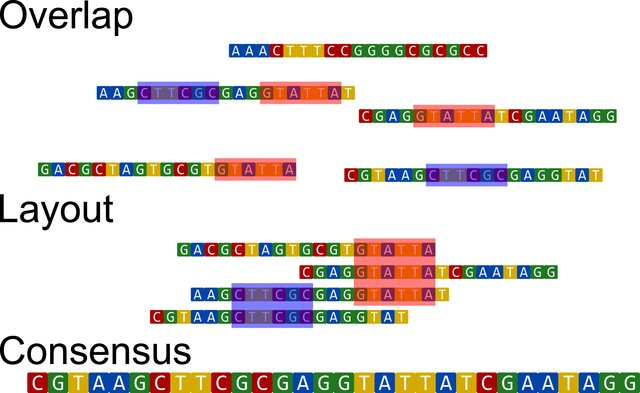
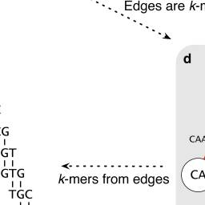

# Class 2.2: Metagenome-assembled genomes assembly, binning, refinement, reassemble

- - - -

## Metagenomic assembly (metaWRAP assembly module)

Sequencing reads are produced randomly and there is no particular order in how DNA or RNA sequences appear in `.fastq` files. Therefore, it is impossible and inaccurate to interpret the raw data as complete or ordered genomes. To reconstruct the genome of organisms the computational process of genome assembly must be undergone. For this, it is common to align the raw reads which is a computationally demanding process.

Genome aseemble have two main algorithms: the Overlap Layout Consensus (OLC) and Debruijn Graph (DBG). The lastest is the most used and implemented in current assembler. In some cases, a circular bacterial genome can be obtained by assembly. However, when unresolvable repeats (without connection) are present, the assembly is broken into fragments called contigs (short for contiguous). Contigs do not contain gaps and are the most common form in which uncomplete assemblies can be found. These contigs can be assembled into scaffolds by ordering and orienting them correctly, creating gaps filled with NNN's.

The OLC methods is purely based on the aligment of each sequenced reads in an attempt to find overlaps. When overlaps are found, a sequence consensus is determined and contigs/scaffolds are constructed. Image from [Goussarov et al. 2022](https://onlinelibrary.wiley.com/doi/10.1002/mbo3.1298).

De Bruijn Graph or k-mer method is more complex. In this scheme, reads are first chopped into k-mer (short substrings of k length). Using these k-mer, the DBG are constructed. These are directional graph were the vertices represent the k-mers' prefixes and suffixes (k-1 mer) that are conected by edges (the input k-mers). Once the graph is constructed, the Eulerian cycle is determined. Eulerian cycle is defined as the path through the graph that visits every edge once and starts and ends in the same vertix. This allows to reconstruct the genome by following successive edges shifted by one position. DBG came as a solution to previous methods as the Hamiltonian cycle which was harder to solve computationally and inefficient in large graphs. Image from [Compeau et al. 2011](https://www.nature.com/articles/nbt.2023).

Moreover, there are two types of genome assemblies: *de novo* and reference-based assembly. *De novo* assembly is where the genome is constructed from scratch without any reference data. Reference-based genomes are designed based on the alignment of raw reads to a genomic reference (e.g. a complete genome of a closely related specie). This later type is computationally simpler, easier, and quicker. However, considering the nature of the metagenomic data, it is unfeasible.

Specifically for shotgun metagenomic assembly, there are two main approaches: individual assembly or by co-assembly. The individual assembly approach assembles all reads of a particular sample, while in co-assemblies reads from all samples (or a group) are used. Co-assemblies favors the assembly of genes with low abundance in individual samples; however, it mixes diversity of closely related strain which might induce biases depending on the research aim. In addition, co-assemblies require considerably more computational resources than individual assemblies.

For this workshop, metagenomic samples will be assembled through the De Bruijn Graph technique in a individual assembly approach using the metaWRAP assembly module.

### MetaWRAP assembly module

[]